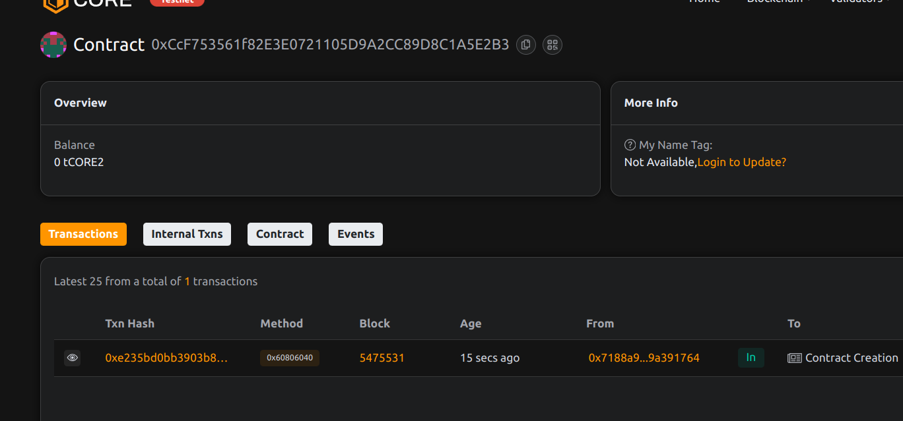

# ProofOfCare: On-Chain Record of Healthcare and Volunteer Activities

## Project Description
ProofOfCare is a blockchain-based system for immutably recording healthcare and volunteer activities. It creates verifiable, tamper-proof records of community service and care work, enabling organizations to track and reward contributions while maintaining complete transparency.

## Project Vision
Our vision is to revolutionize how care work and volunteer hours are tracked and valued by creating an immutable, universally accessible record system. ProofOfCare aims to bring recognition to often-invisible labor and enable new forms of compensation and reward systems.

## Key Features
- Tamper-proof activity recording
- Multiple activity type classification
- Verifier authorization system
- Individual contribution tracking
- Timestamped immutable records
- Transparent verification process

## Future Scope
- NFT-based certification of hours
- Cross-organization recognition
- Token reward integration
- Skill-based categorization
- Multi-chain compatibility
- Privacy-preserving options

## Contract Details
0xCcF753561f82E3E0721105D9A2CC89D8C1A5E2B3
